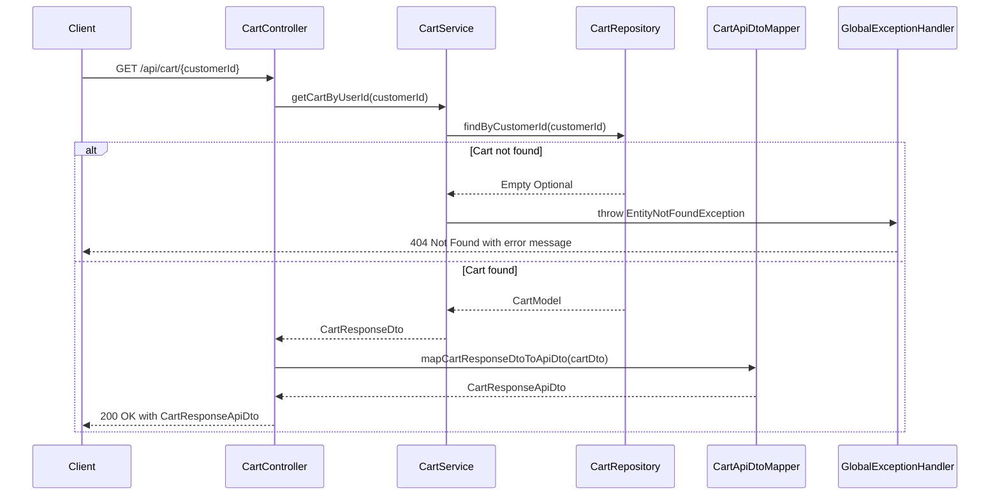
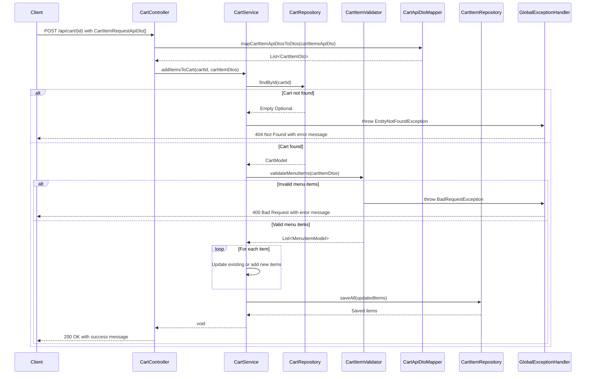
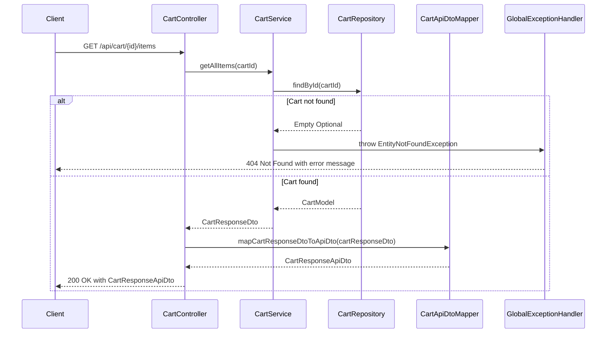
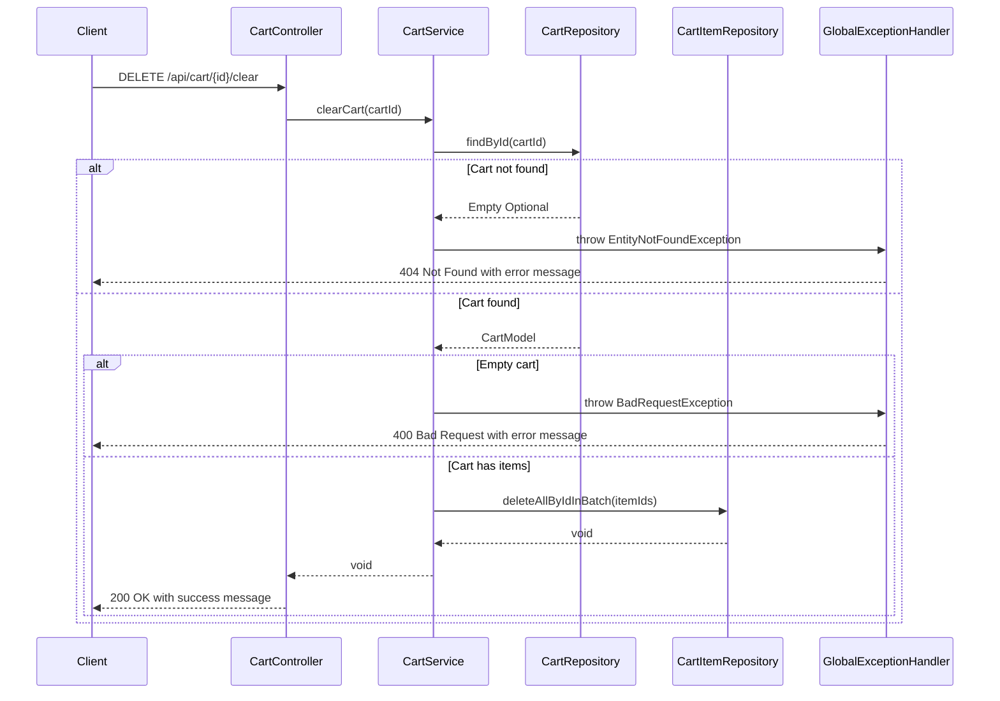

# Cart Management Sequence Diagram

This diagram illustrates the interactions between components in the cart management system of the Elmenus Lite application.

## Components
- **Client**: The frontend application or API client making requests
- **CartController**: REST controller that handles cart-related HTTP requests
- **CartService**: Business logic layer for cart operations
- **CartRepository/CartItemRepository**: Data access layer for cart entities
- **CartItemValidator**: Validates cart items before operations
- **CartApiDtoMapper**: Maps between API DTOs and internal DTOs
- **GlobalExceptionHandler**: Handles exceptions and returns appropriate HTTP responses

## 1. Get Cart by User ID

## 2. Add/Update Cart Items

## 3. Get Cart Items

## 4. Clear Cart

## Component Descriptions

### Main Components:
- **Client**: The frontend application or API client making requests
- **CartController**: REST controller that handles cart-related HTTP requests
- **CartService**: Business logic layer for cart operations
- **CartRepository/CartItemRepository**: Data access layer for cart entities
- **CartItemValidator**: Validates cart items before operations
- **CartApiDtoMapper**: Maps between API DTOs and internal DTOs
- **GlobalExceptionHandler**: Handles exceptions and returns appropriate HTTP responses

### Key Flows:

1. **Get Cart by User ID**:
   - Retrieves a user's cart with all items
   - Maps internal DTOs to API DTOs before returning to client

2. **Add/Update Cart Items**:
   - Validates menu items
   - Updates existing items or adds new ones
   - Handles batch operations efficiently

3. **Get Cart Items**:
   - Returns all items in a specific cart
   - Similar flow to getting cart by user ID

4. **Clear Cart**:
   - Removes all items from a cart
   - Validates cart existence and that it's not already empty
